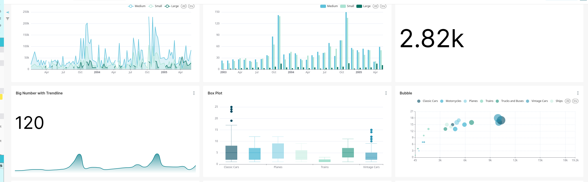

---
hide:
  - navigation
  - toc
---

# Home

## What is it ?

This component uses [Apache Superset](https://superset.apache.org/) to provide you with the capacity to build and share dashboards, featuring a lot of dataviz tools.

There are actually very little differences with the mainstream Apache Superset, limited to adjustments to fully integrate it into your geOrchestra instance (user authentication, roles management).

This component is _optional_ and not provided by default. You will have to _add it_ to your platform if not already present.

