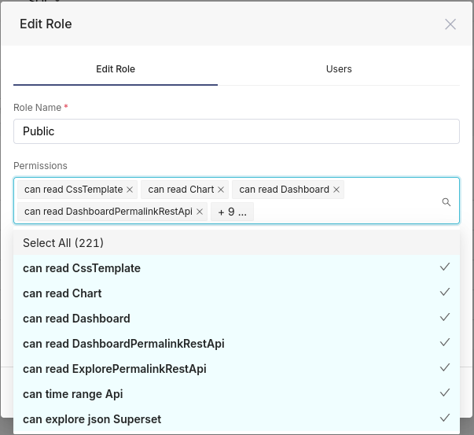

# Making a dashboard publicly accessible

Roles can be assigned to an authentified user, in order to manage this user's access permissions (e.g. view a given dashboard). _But how does it work for non-authentified visitors (guests) ?_

This is very shortly mentioned in the [official Superset doc](https://superset.apache.org/docs/security/#public) but not detailed. Here are some complements of information.

## Basic mechanism

Superset has a role named `Public` that matches unauthenticated visitors. By default, it is empty (they are not allowed in any part of Superset).

What guest visitors will be able to access will depend on each platform. In this section below will assume that your goal is to share only dashboards, without giving them access to the dashboards' configuration or datasets. View-only access. To achieve such goal, the following profile seems sufficient:

- here is the basic set of global permissions necessary

- To this, it is necessary to add the read permission on the datasets used by the dashboard's charts. See below for more details on how to do it

## How to bootstrap the Public role with such permissions

By default on first startup, the Public role is empty. There are at least 2 ways to set those permissions for the `Public` role:

- **Option 1** is to add _manually_ some ACLs into this role, after having deployed Superset. 
- **Option 2** is proposed in the Superset doc: one can set the `PUBLIC_ROLE_LIKE` config parameter to another role that will serve as template for the `Public` role. During the `superset init` phase, Superset will _merge_ all permissions listed in the template into the Public role. The trick is that, in this wase, we want to use as template a role that doesn't exist yet. This can be done by first importing the template role and is documented just below.

### Importing the Guest_template role

The [geOrchestra superset](https://github.com/georchestra/superset) git repository provides you with a definition for a role named `Guest_template`, that patches the expected base definition for `Public`. It is in [config/superset/georchestra_custom_roles.json](https://github.com/georchestra/superset/blob/main/config/superset/georchestra_custom_roles.json).

This role needs to be available before the `superset init` stage, so we need to import it before that, or you will get an error when Superset tries to import the permissions into role `Public`.

The way to apply this depends on how Superset is deployed:

#### Standard startup

The CLI syntax for importing the role is 
```
superset fab import-roles -p georchestra_custom_roles.json 
```

And, of course, it is necessary to uncomment the proper configuration parameter in [superset_georchestra_config.py](https://github.com/georchestra/superset/blob/main/config/superset/superset_georchestra_config.py#L60): `PUBLIC_ROLE_LIKE = "Guest_template"`

Then you can run the next startup stages, including `superset init`

#### On docker compose
- In [superset_georchestra_config.py](https://github.com/georchestra/superset/blob/main/config/superset/superset_georchestra_config.py#L60), uncomment the `PUBLIC_ROLE_LIKE = "Guest_template"` line.
- In docker-compose-superset.yml, uncomment the [`superset-docker-init.sh` volume line](https://github.com/georchestra/superset/blob/main/docker/docker-compose.superset.yml#L28).

Then refresh your composition (`docker compose up`).

#### On kubernetes
- In [superset_georchestra_config.py](https://github.com/georchestra/superset/blob/main/config/superset/superset_georchestra_config.py#L60), uncomment the `PUBLIC_ROLE_LIKE = "Guest_template"` line.
- In the helm chart, set the extraConfigs."georchestra_custom_roles\.json" file. The [init script](https://github.com/georchestra/superset/blob/main/kubernetes/georchestra-values.yaml#L80) will load the roles defined in there at startup, including the `Guest_template` one.


## Add read permissions to the dataset

Once set the basic permissions to the Public role, as documented above, it is still necessary to grant access to the datasets used by the dashboard you want to make public.

You could either add them in the `Guest_template` role, in which case the init script needs to be run again to merge the roles into `Public` role. Or you can define them directly in `Public` from the GUI.

There are several levels of granularity that are possible:

### All datasources

Granting access to all datasources is the simplest way, ***but this is not recommended*** (not secure). It is advised to use this only for testing purposes.

It is done by adding the permission `all datasource access on all_datasource_access` to the `Public` role. 

By granting access to all datasources, access is inherited to the charts and dashboards using the datasources. All datasources => all dashboards can be seen.

### Database-level granularity

A finer level of granularity is to grant access to the datasource based on the database they are from. This is a bit more restricted, but still probably not safe enough. 

Still, it can make sense for instance if dealing with an open data DB.

It is done by adding the permission `database access on [name of your database]` to the `Public` role. The name being the one used in the databases configuration in Superset.

By granting access to the database, access is inherited to the charts and dashboards using the datasources coming from this database. 

### Datasource (dataset)-level granularity

***This is the safest and the recommended way***. 

It requires to add to the `Public` role the permissions `datasource access on [name of your database].[name of your datasource]`. If your dahsbord relies on many datasources, this may mean adding a lot of permission items (one per datasource). But this ensures an access limited to the smallest data perimeter.


