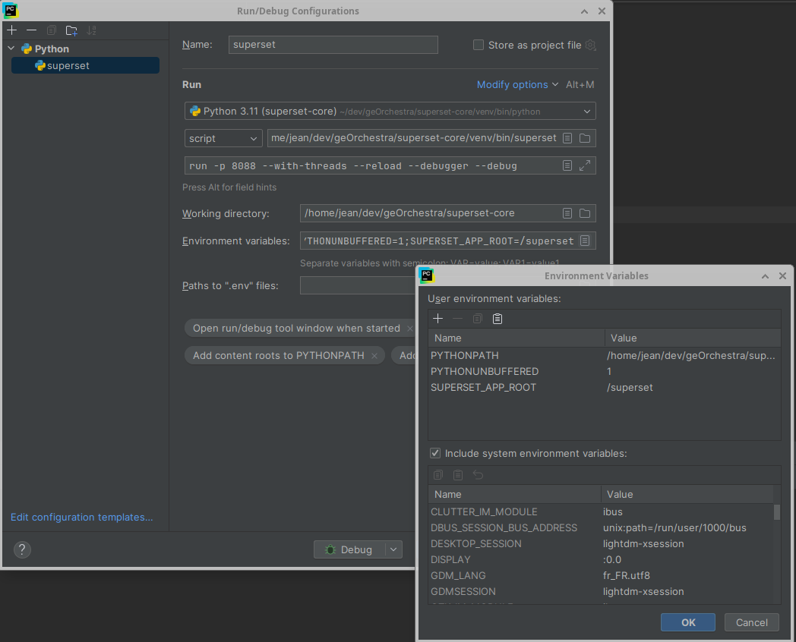
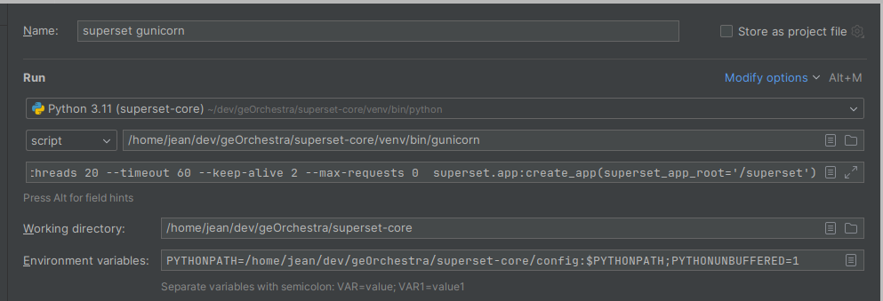

# Set up a development environment

## Clone the georchestra superset-core repo (One-time action)

```bash
git clone https://github.com/georchestra/superset-core.git
cd superset-core
```

## Config files (One-time action)

You will want to use a geOrchestra-focused configuration.

You can copy the content from https://github.com/georchestra/superset/tree/main/config/superset:
```bash
mkdir -p config
for f in superset_georchestra_config.py georchestra_custom_roles.json LocalizationFr.py GeorchestraCustomizations.py; do
  wget -O config/$f https://raw.githubusercontent.com/georchestra/superset/refs/heads/main/config/superset/$f
done
```

Then you will still have to export the path to those confgi files at each run (see below)


## Virtualenv

Set up following https://superset.apache.org/docs/contributing/development#alternatives-to-docker-compose: 

```bash
# Create a virtual environment and activate it (recommended)
python3 -m venv venv # setup a python3 virtualenv
source venv/bin/activate

# Install external dependencies
pip install -r requirements/development.txt

# Install Superset in editable (development) mode
pip install -e .
```

## Config files
Config files are in `config/`
Activate it running
```bash
export PYTHONPATH=$PWD/config:$PYTHONPATH
```

## Set sec-headers in firefox (dev mode, superset only, no georchestra instance)
I'm using ModHeader extension

REMOTE_USER/HTTP_PROXY_REMOTE_USER info should be set on the Response Headers

## Build javascript assets
If we don't use the docker-compose way to run superset, we need to build at least once the frontend before running Superset (or we won't get any GUI)

_**Warning**: for the frontend, look in the docs' source code which node version is required (node v20/npm10 for superset 5)_

Building the javascript static assets is in the end a bit tricky with the docker compose (I haven't yet really figured out their logic).

For dev purposes, it's simpler to build manually:
```bash
# Disable SCARF analytics reporting
export SCARF_ANALYTICS=false

# Use Node 20 (code "iron")
nvm install lts/iron
nvm use lts/iron

# Install dependencies from `package-lock.json`
npm --prefix superset-frontend prune
npm --prefix superset-frontend install
npm --prefix superset-frontend run build

# Build i18n support
npm --prefix superset-frontend run build-translation
```
or   
`./build-frontend.sh`

## Build python translations
`pybabel compile -d superset/translations | true`  
Generates a lot of error messages, but this is working still (piping to true ensure a positive outcome)

or   

`./build-frontend.sh`
builds the frontend and both translations in one go

## Run setup

### CLI

#### Run the dependencies
We need db and redis dependencies. Running them with docker is probably the simplest:
```bash
docker compose up -d db redis
docker compose logs -f
```

If you haven't yet initialized the DB (needs to be done the first time only), you can run:

```bash
# Create an admin user in your metadata database
superset db upgrade
superset fab create-admin

# Load some data to play with(option)
superset load_examples

# Import Guest_template role
superset fab import-roles -p config/georchestra_custom_roles.json 

#Create default roles and permissions
superset init
```

#### Run Superset
Then, still on the CLI:

```bash
# Activate the venv if not done
source venv/bin/activate

# Activate the config
export PYTHONPATH=$PWD/config:$PYTHONPATH
# Make the header config file available
wget -O superset/static/assets/header-config.json  https://raw.githubusercontent.com/georchestra/superset/refs/heads/main/extras/header-config.json

# Set the path prefix
export SUPERSET_APP_ROOT=/superset

# Start the dev server
superset run -p 8088 --with-threads --reload --debugger --debug

# Alternative ways to run the server
# export FLASK_APP="superset:create_app(superset_app_root='/superset')"
# flask run -p 8088 -h 0.0.0.0
# or
# flask --app "superset.app:create_app(superset_app_root='/superset')" run -p 8088 -h 0.0.0.0
```


#### Prod-like run:
```
pip install gevent gunicorn

gunicorn -w 5 \
-k gevent \
--worker-connections 1000 \
--timeout 120 \
-b  0.0.0.0:8088 \
--limit-request-line 0 \
--limit-request-field_size 0 \
"superset.app:create_app(superset_app_root='/superset')"
```

### PyCharm

If not created from the commandline, create the virtual env and install the dependencies (cf CLI setup).
Here's a working run configuration (sets an app prefix of `/superset`):



Superset will be available under http://127.0.0.1:8088/superset

And another config to run with gunicorn


### Docker-compose only
I don't really understand their docker-compo setup for dev, so I prefer to work CLI/Pycharm when developing.

To run the full docker compo stack, I'm usually going with the docker-compose-image-tag.yml file and change the tag with a geOrchestra one:
```bash
# Set the /superset path prefix
cat > docker/.env-local <<EOL
SUPERSET_APP_ROOT="/superset"
# Add here you custom env vars
EOL

# Customize the docker image, use the georchestra one
sed -i "s|^x-superset-image: .*|x-superset-image: \&superset-image georchestra/superset:latest|" docker-compose-image-tag.yml

docker compose -f docker-compose-image-tag.yml up -d
```

If you want to use the georchestra custom config, you'll have to add them in the docker/pythonpath_dev. The config entrypoint has to be named `docker/pythonpath_dev/superset_config_local.py`


