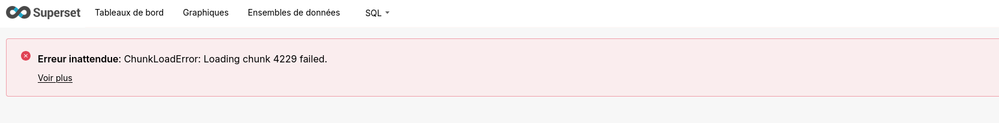

# Troubleshooting

## Debugging

You will find instructions on how to set up a development environment on the [contribute section](../contribute/dev_setup.en.md).

Also keep in mind that this is just a small-ish extension of Superset. You can refer to [Superset Contribute section](https://superset.apache.org/docs/contributing/development) for more information about how to set up a development/debugging installation. Then follow our [manual install section](install-manual.md) to figure out how to activate our customizations. And start your superset instance with a debugging tool (your python IDE, pdb etc).

## Logging

There are at least 3 logging pipes:

### Superset app logging

Basically, the logs are sent to stdout. It is relying on standard python `logging` package but passing through Superset's own logging class Cf [config.py ](https://github.com/apache/superset/blob/master/superset/config.py#L933).

The geOrchestra customizations provides with an [alternative logging class](https://github.com/georchestra/superset/blob/main/config/superset/GeorchestraCustomizations.py#L315) [used in replacement](https://github.com/georchestra/superset/blob/main/config/superset/superset_georchestra_config.py#L15). You can use this basis to add any customizations you need.

You can change the logging level by changing the [LOG_LEVEL](https://github.com/georchestra/superset/blob/main/config/superset/superset_georchestra_config.py#L12) config value ot providing the eponym environment variable.

To know more about logging in python, have a look at 

- [python logging cookbook](https://docs.python.org/3/howto/logging-cookbook.html#logging-cookbook)
- [python logging howto](https://docs.python.org/3/howto/logging.html)

### Gunicorn access logs

Gunicorn also writes access logs. Those are configured in the [entrypoint](https://github.com/georchestra/superset-core/blob/main-georchestra/docker/entrypoints/run-server.sh#L22) when running docker/kubernetes and can be configured by setting the corresponding envivonment variables. 

When running it as a classic service, you'll have a similar configuration.

### Event logger

Superset implements a separate logging for all superset events. Superset stores it by default in the applicative database (in your `superset` schema). This behaviour is configured in Superset main [config.py ](https://github.com/apache/superset/blob/master/superset/config.py#L82-L86)file.

By default geOrchestra overrides this in https://github.com/georchestra/superset/blob/main/config/superset/superset_georchestra_config.py#L84 and disables the event logging

!!! warning "Why not use the DBEventLogger ?"

    By default, Superset uses a DBEventLogger, storing all actions on
    Superset, in the DB.  
    Problem is that it can bloat the DB after some time.

    And since we _now have to allow writing to the event logs to `Public` role_
    to avoid having error messages (see [related commit](https://github.com/georchestra/superset/commit/fa5df900fcf0cb081ce26bf72d6ad6ceda122b4c)), writing logs in the DB
    doesn't feel that safe anymore.  
    We can alternatively use the StdOutEventLogger that logs those events
    on stdout.  
    By default, the NullEventLogger doesn't log them at all,
    it will be up to the platform admins to see if they want to log them and how.

    On the longer term, we'll probably be considering adding back some logging
    mechanism for analytics purposes.

## "Chunk load error"

You might encounter sometimes errors when loading a Superset page. For instance a "chunk load error". _A priori_ in the situation where your geOrchestra instance uses the Gateway (not reported for now with the Security Proxy).

Those are quite annoying. But can be avoided.

Looking at the gateway logs, you will likely notice PrematureCloseException or similar exceptions everytime a chunk load error happens.
The issue is Superset/gunicorn closing connections while upstream reverse-proxies are still thinking them active.
Setting the env var GUNICORN_KEEPALIVE to 30 (seconds) does the trick. Maybe we don't need to increase them that much, but the default, 2s, seems really too short (and is documented in https://docs.gunicorn.org/en/stable/settings.html#keepalive).

In any case, we need to make sure that: 
`gunicorn keepalive >= gateway max-idle-time >= traefik/nginx ingress idleConnTimeout`.

Ref. [Superset issue 28259](https://github.com/apache/superset/issues/28259#issuecomment-2834537288)